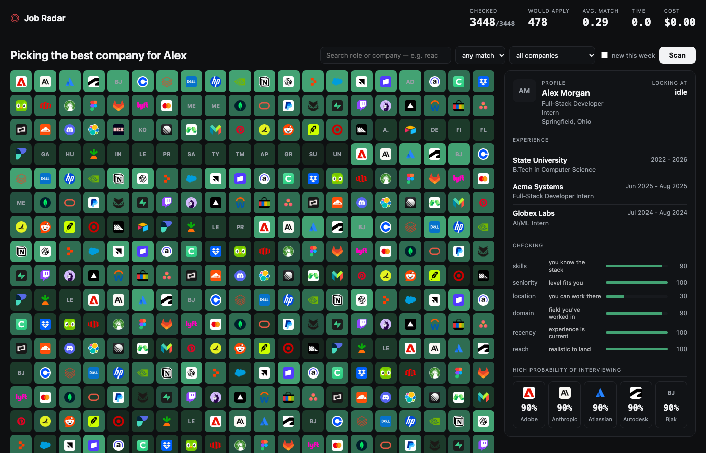
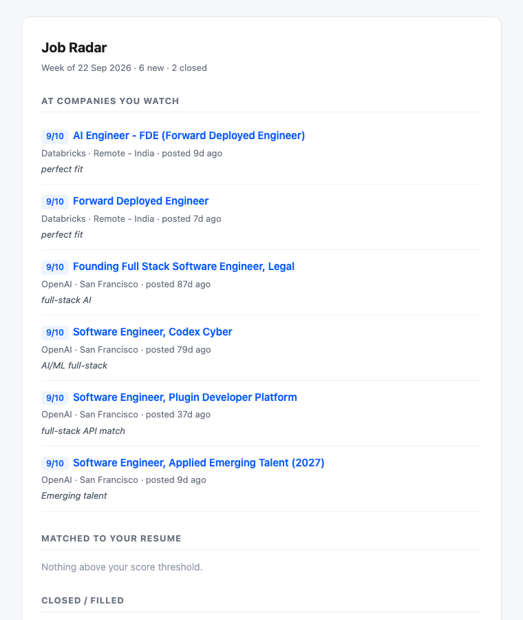

# Job Radar

Watches company job boards, scores every opening against your resume, and
emails you when something worth applying to shows up.



It tracks 56 companies across seven ATS platforms — Greenhouse, Lever, Ashby,
Workable, Workday, Oracle Recruiting Cloud — which is what it takes to cover
both startups and large enterprises on one list.

## What it does

- **Finds new openings.** Every job gets a stable id, so "new" means new.
- **Notices when jobs close.** A posting that disappears is marked dead and hidden.
- **Ranks against your resume.** 0–10 with a reason, from an LLM that reads the
  job description.
- **Daily alerts** for a shortlist of companies — email plus a desktop notification.
- **Weekly digest** every Monday, ranked.
- **A local web UI** to search and filter everything.



## Why it isn't just keyword matching

Two rules run in code, not in the prompt, because a model asked nicely will
comply inconsistently:

**Seniority.** A Senior/Staff/Principal title caps at 3/10 however well the
skills match. Without this, senior roles held 31 of the top 100 slots and the
first junior role sat at position #67 — the jobs a new graduate could actually
get were buried under the ones they could not.

**Relevance.** A role weak on both skills and domain caps at 3/10. Otherwise a
branch-office internship scores 8/10 for a developer purely because it is an
internship.

Both are arithmetic on data already stored, so `recap` re-applies them for free.

## Setup

Needs Python 3.11+ and a Mac (the schedules use launchd).

```bash
git clone https://github.com/Rohan-Singhh/jobradar.git
cd jobradar
./install.sh
```

Then three things:

**1. Your resume** — put a PDF in the folder, point `resume_path` at it in
`config.yaml`.

**2. Your keys** — `cp run.example.sh run.sh`, then fill in:

- An LLM key. Any OpenAI-compatible endpoint works; the default is
  [xkiro](https://xkiro.com) with Mistral Large 3, which has a free tier.
- A [Gmail App Password](https://myaccount.google.com/apppasswords) for sending
  mail. Needs 2FA on the account first.

**3. Check it works**

```bash
./run.sh test          # sends a test email
./run.sh scan          # fetch, diff, score
./run-web.sh           # http://localhost:8765
```

## Configuration

```yaml
companies:
  - { name: 'Adobe', board: workday, slug: 'adobe/wd5/external_experienced' }

alerts:
  companies: [Adobe, Oracle, Atlassian]   # checked daily
  min_score: 6

llm:
  provider: xkiro
  model: mistralai/mistral-large-2512
  daily_token_limit: 1000000
```

Find a company's board and slug in its careers URL:

| URL | board | slug |
|---|---|---|
| `boards.greenhouse.io/figma` | greenhouse | `figma` |
| `jobs.ashbyhq.com/ramp` | ashby | `ramp` |
| `jobs.lever.co/spotify` | lever | `spotify` |
| `adobe.wd5.myworkdayjobs.com/external_experienced` | workday | `adobe/wd5/external_experienced` |

## Commands

```bash
./run.sh scan          # fetch, diff, score
./run.sh alert         # check the shortlist, alert if anything opened
./run.sh digest        # send the weekly email
./run.sh recap         # re-apply the scoring rules, no tokens
./run.sh list          # the week's finds in the terminal
./run-web.sh           # web UI
```

`install.sh` registers two launchd jobs: daily alerts at 09:30, weekly digest
Mondays at 09:00.

## Token budget

Free tiers have a daily cap, so the budget is checked before every request and
recorded per batch. A run that hits the ceiling stops and resumes next time —
it can't lock you out of your key.

Jobs are scored 25 per request with compact positional replies. A full 3,400-job
scan costs about 340K tokens. After that only new postings are scored, which is
a few thousand a week.

## Tests

```bash
for t in tests/test_*.py; do ./.venv/bin/python "$t"; done
```

Ten suites. Most exist because something broke in use — a threading crash in
the live scan, an alert that would have fired 142 notifications at once, a
malformed reply that killed a 3,000-job run.

See [OVERVIEW.md](OVERVIEW.md) for architecture and design notes.

## Notes

Built by [@Rohan-Singhh](https://github.com/Rohan-Singhh). The grid UI took small
inspiration from [this post](https://x.com/sarvagya_kul/status/2100980770206879849).

Scores are a sort order, not a verdict — a 4/10 is still worth a glance.

MIT
